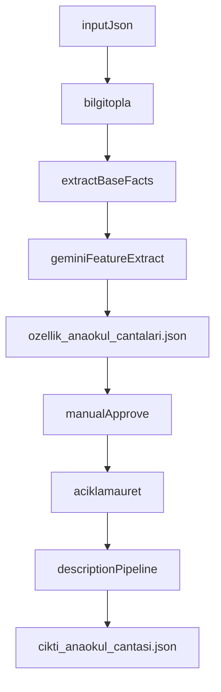

# Gemini Ozellik Toplama ve Aciklama Uretme Plani

## Hedef

Mevcut tek aşamalı üretim akışını iki ayrı sürece bölmek:

- `bilgitopla`: Gemini ile ürün verisinden yapılandırılmış özellik JSON'u üretir.
- `aciklamauret`: Onaylanmış özellikleri kullanarak HTML ürün açıklamasını üretir.

Bu ayrım sayesinde teknik bilgi çıkarımı ve pazarlama/SEO metni üretimi birbirine karışmaz; önce veri kontrol edilir, sonra açıklama üretilir.

## Mevcut Yapıya Dayanak

Mevcut giriş verisinde ürün açıklama kaynağı zaten mevcut:

- `[c:\Users\Monster\Desktop\mavikalem\otomasyon\data\input\urunler.json](c:\Users\Monster\Desktop\mavikalem\otomasyon\data\input\urunler.json)` içindeki `AciklamaHtml`
- `[c:\Users\Monster\Desktop\mavikalem\otomasyon\src\scripts\excel-to-json.js](c:\Users\Monster\Desktop\mavikalem\otomasyon\src\scripts\excel-to-json.js)` bu alanı Excel `details` kolonundan üretiyor

Mevcut Gemini istemcisi yalnızca HTML açıklama yazıyor:

- `[c:\Users\Monster\Desktop\mavikalem\otomasyon\src\lib\geminiClient.js](c:\Users\Monster\Desktop\mavikalem\otomasyon\src\lib\geminiClient.js)`

Mevcut teknik alanlar template içinde varsayılan dolduruluyor:

- `[c:\Users\Monster\Desktop\mavikalem\otomasyon\src\generators\preschoolBagTemplate.js](c:\Users\Monster\Desktop\mavikalem\otomasyon\src\generators\preschoolBagTemplate.js)`

## Yeni Mimari




## Uygulama Adimlari

### 1. Ozellik cikarma icin ayri Gemini katmani ekle

Yeni bir modül oluştur:

- `[c:\Users\Monster\Desktop\mavikalem\otomasyon\src\lib\geminiFeatureExtractor.js](c:\Users\Monster\Desktop\mavikalem\otomasyon\src\lib\geminiFeatureExtractor.js)`

Sorumlulukları:

- Ürün adı, marka, kategori, stok kodu ve `AciklamaHtml/details` metnini prompt'a koymak
- Gemini'den yalnızca JSON istemek
- JSON parse etmek ve normalize etmek
- Emin olunmayan alanları boş bırakmak veya `Belirtilmemiş` yapmak

Olası çıktı şeması:

```json
{
  "StokKodu": "35.09.03.004",
  "UrunAdi": "Adel Junior Slam Dunk Anaokul Çantası 000187",
  "Kategori": "Anaokul Çantası",
  "Ozellikler": {
    "materyal": "Polyester",
    "boyut": "30x25x12 cm",
    "agirlik": "250 gr",
    "bolmeSayisi": "2 Ana + 1 Ön Cep",
    "renk": "Mavi",
    "yasGrubu": "3-6 Yaş"
  },
  "Kaynak": "gemini-from-input-details",
  "Durum": "bekliyor"
}
```

### 2. Prompt'u veri cikarma odakli tasarla

Açıklama prompt'undan ayrı bir extraction prompt kullanılacak.

Prompt kuralları:

- Sadece geçerli JSON döndür
- Sadece verilen metinden çıkarım yap
- Metinde yoksa tahmin etme
- Emin değilsen boş string döndür
- HTML açıklama üretme
- Anaokul çantası için sınırlı alan seti kullan

İlk sürümde alan seti sabit tutulmalı:

- `materyal`
- `boyut`
- `agirlik`
- `bolmeSayisi`
- `renk`
- `yasGrubu`
- `karakter`
- `yikanabilirlik`

### 3. Bilgi toplama komutunu ayri script olarak ekle

Yeni script önerisi:

- `[c:\Users\Monster\Desktop\mavikalem\otomasyon\src\scripts\collect-features.js](c:\Users\Monster\Desktop\mavikalem\otomasyon\src\scripts\collect-features.js)`

Bu script:

- `data/input/urunler.json` dosyasını okur
- Gerekirse `TARGET_CATEGORY` ile filtreler
- Her ürün için önce mevcut parser'dan taban `facts` üretir
- Ardından Gemini extraction çağrısı yapar
- Sonucu `data/output/ozellik_anaokul_cantalari.json` dosyasına yazar

Komut örneği:

```powershell
$env:TARGET_CATEGORY="Anaokul Çantası"
$env:OUTPUT_FILE="ozellik_anaokul_cantalari.json"
node src/scripts/collect-features.js
```

### 4. Aciklama uretimini ozellik dosyasindan besle

Mevcut üretim akışı doğrudan input JSON'dan çalışıyor:

- `[c:\Users\Monster\Desktop\mavikalem\otomasyon\src\index.js](c:\Users\Monster\Desktop\mavikalem\otomasyon\src\index.js)`

Planlanan değişiklik:

- `aciklamauret` modunda ürün input'u ile birlikte onaylı özellik dosyası da okunur
- `extractProductFacts()` sonrası onaylı özellikler `facts` içine merge edilir
- Böylece template içindeki varsayılan değerler yerine kontrol edilmiş teknik alanlar kullanılır

Birleştirme sırası şöyle olmalı:

1. Input JSON temel alanları
2. Regex/parser ile bulunan alanlar
3. Onaylı özellik JSON'u

Bu sıra, manuel onaylı verinin en yüksek önceliğe sahip olmasını sağlar.

### 5. Iki ayri calisma modu tanimla

Kullanıcı beklentisi iki bağımsız çalışma akışı:

- `bilgitopla` sadece özellik JSON'u üretsin
- `aciklamauret` sadece açıklama üretsin

Bunu iki farklı script ile çözmek daha temiz olur:

- `src/scripts/collect-features.js`
- mevcut `src/index.js` veya gerekirse `src/scripts/generate-descriptions.js`

Bu tercih, tek script içinde karmaşık `MODE` kontrolleri yazmaktan daha anlaşılır olur.

### 6. Review surecini kolaylastir

`ozellik_anaokul_cantalari.json` dosyasında kullanıcı kontrolünü kolaylaştırmak için her kayıtta şu alanlar bulunmalı:

- `StokKodu`
- `UrunAdi`
- `Kategori`
- `Ozellikler`
- `Kaynak`
- `Durum`

`Durum` başlangıçta `bekliyor` olabilir. Sonra kullanıcı bunu manuel olarak `onaylandi` yapabilir. Açıklama üretimi isterse sadece `onaylandi` kayıtları kullansın.

### 7. Guvenlik ve kalite kurallari ekle

Özellik çıkarımı için şu guard'lar eklenmeli:

- `AciklamaHtml/details` boşsa Gemini çağrısı yapma
- JSON parse edilemezse ürünü `hata` durumuyla yaz
- Sayısal alanlar normalize edilsin: `250gr` -> `250 gr`
- Ölçü alanı normalize edilsin: `30 x 25 x 12 cm` -> `30x25x12 cm`
- Tahmini/hayali veri üretilmesini önlemek için prompt'ta net yasak olsun

### 8. Aciklama template'lerini onayli veriye gore sade sekilde kullan

Özellikle anaokul çantası tarafında template mevcut:

- `[c:\Users\Monster\Desktop\mavikalem\otomasyon\src\generators\preschoolBagTemplate.js](c:\Users\Monster\Desktop\mavikalem\otomasyon\src\generators\preschoolBagTemplate.js)`

Burada teknik tablo alanları doğrudan onaylı özellik JSON'undan beslenecek. Böylece açıklama üretimi ayrı, veri üretimi ayrı kalacak.

## Beklenen Sonuc

Kurulum tamamlandığında kullanım sırası şöyle olacak:

1. Excel -> `urunler.json`
2. `bilgitopla` -> `ozellik_anaokul_cantalari.json`
3. Manuel kontrol / onay
4. `aciklamauret` -> `cikti_anaokul_cantasi.json`

Bu akış kullanıcıya iki ayrı düğme/komut mantığı verir:

- `bilgitopla` dediğinde yalnızca yapılandırılmış özellik üretimi
- `aciklamauret` dediğinde yalnızca açıklama üretimi

## Dosya Etki Alani

Değişmesi veya eklenmesi beklenen ana dosyalar:

- `[c:\Users\Monster\Desktop\mavikalem\otomasyon\src\lib\geminiClient.js](c:\Users\Monster\Desktop\mavikalem\otomasyon\src\lib\geminiClient.js)`
- `[c:\Users\Monster\Desktop\mavikalem\otomasyon\src\lib\productFacts.js](c:\Users\Monster\Desktop\mavikalem\otomasyon\src\lib\productFacts.js)`
- `[c:\Users\Monster\Desktop\mavikalem\otomasyon\src\generators\preschoolBagTemplate.js](c:\Users\Monster\Desktop\mavikalem\otomasyon\src\generators\preschoolBagTemplate.js)`
- `[c:\Users\Monster\Desktop\mavikalem\otomasyon\src\index.js](c:\Users\Monster\Desktop\mavikalem\otomasyon\src\index.js)`
- `[c:\Users\Monster\Desktop\mavikalem\otomasyon\src\lib\geminiFeatureExtractor.js](c:\Users\Monster\Desktop\mavikalem\otomasyon\src\lib\geminiFeatureExtractor.js)`
- `[c:\Users\Monster\Desktop\mavikalem\otomasyon\src\scripts\collect-features.js](c:\Users\Monster\Desktop\mavikalem\otomasyon\src\scripts\collect-features.js)`

## Not

İlk sürümde yalnızca `Anaokul Çantası` kategorisi için uygulanması en güvenli başlangıç olur. Sistem oturduktan sonra diğer kategorilere genişletilebilir.