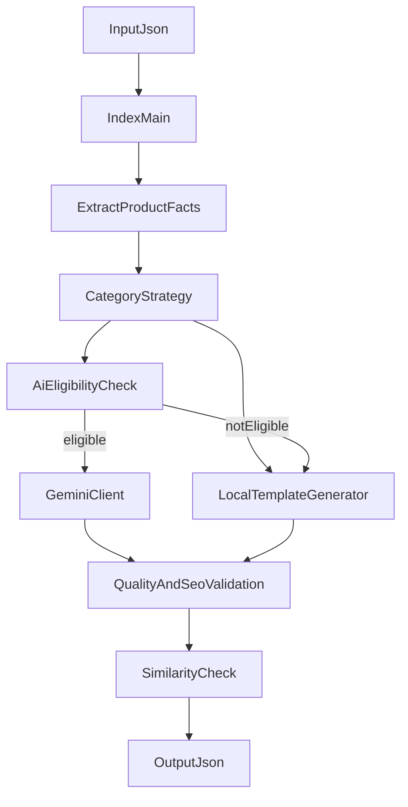

# Ürün Açıklama Otomasyonu Yol Haritası

## Hedef

Mevcut JSON tabanlı ürün açıklama sistemini bırakmadan, kontrollü AI desteği, daha doğru kategori eşleşmesi ve daha güçlü kalite kontrolleri ile ölçeklenebilir hale getirmek.

## 1. Stabilizasyon

- Kategori eşleşmelerini genişlet: [Açıklama Otomasyon/config/categories.js](c:\Users\Monster\Desktop\mavikalem\otomasyon\Açıklama Otomasyon\config\categories.js)
- Özellikle `Versatil`, `Versati`, `AYT Hazırlık`, çanta ve benzeri fiili veri varyasyonlarını kapsa.
- Girdi/çıktı yollarını netleştir: tek giriş noktası [Açıklama Otomasyon/index.js](c:\Users\Monster\Desktop\mavikalem\otomasyon\Açıklama Otomasyon\index.js) üzerinden `data/input/urunler.json` ve `data/output/cikti.json` gibi standart klasör yapısı kullanılmalı.
- Çıktıda hangi motorun kullanıldığını (`gemini`, `local-template`, `local-fallback`) koru; bu alan operasyon takibi için kritik.

## 2. Kalite Güçlendirme

- Açıklama benzerliğini sadece ölçmekle kalma, yüksek benzerlikte yeniden üretim veya farklı varyasyon dene: [Açıklama Otomasyon/index.js](c:\Users\Monster\Desktop\mavikalem\otomasyon\Açıklama Otomasyon\index.js), [Açıklama Otomasyon/lib/similarity.js](c:\Users\Monster\Desktop\mavikalem\otomasyon\Açıklama Otomasyon\lib\similarity.js)
- Kategori bazlı minimum kelime ve benzerlik eşikleri ekle: [Açıklama Otomasyon/config/seoRules.js](c:\Users\Monster\Desktop\mavikalem\otomasyon\Açıklama Otomasyon\config\seoRules.js)
- Teknik bilgisi zayıf ürünler için daha nötr açıklama şablonları kullan; uydurma fayda cümlelerini azalt.

## 3. Kontrollü AI Aktivasyonu

- Önce `book`, `set`, `tech` kategorilerinde Gemini kullanımını doğrula.
- Sonra istenirse `stationery` için `aiRecommended: true` ile kontrollü açılım yap: [Açıklama Otomasyon/config/categories.js](c:\Users\Monster\Desktop\mavikalem\otomasyon\Açıklama Otomasyon\config\categories.js)
- Tam açıklamayı tamamen AI'ya bırakmak yerine hibrit modeli düşün:
  - giriş paragrafı AI
  - teknik liste lokal
  - SSS hibrit
- Gemini başarısız olursa mevcut fallback akışını koru: [Açıklama Otomasyon/lib/geminiClient.js](c:\Users\Monster\Desktop\mavikalem\otomasyon\Açıklama Otomasyon\lib\geminiClient.js)

## 4. Kategori Bazlı İçerik Kalitesi

- Mevcut üreticileri genişlet:
  - [Açıklama Otomasyon/generators/stationeryTemplate.js](c:\Users\Monster\Desktop\mavikalem\otomasyon\Açıklama Otomasyon\generators\stationeryTemplate.js)
  - [Açıklama Otomasyon/generators/bookTemplate.js](c:\Users\Monster\Desktop\mavikalem\otomasyon\Açıklama Otomasyon\generators\bookTemplate.js)
  - [Açıklama Otomasyon/generators/setTemplate.js](c:\Users\Monster\Desktop\mavikalem\otomasyon\Açıklama Otomasyon\generators\setTemplate.js)
  - [Açıklama Otomasyon/generators/techTemplate.js](c:\Users\Monster\Desktop\mavikalem\otomasyon\Açıklama Otomasyon\generators\techTemplate.js)
- Her kategori için ayrı tone-of-voice, FAQ ve kapanış varyasyonları ekle.
- Kitap, kırtasiye, çanta, teknoloji gibi grupları gerçekten ayrışan metin yapılarıyla üret.

## 5. Operasyon ve Onay Akışı

- Çıktıyı sadece açıklama değil, inceleme dostu raporla üret:
  - ürün adı
  - stok kodu
  - kategori
  - üretim kaynağı
  - benzerlik skoru
  - fallback nedeni
- SEO uzmanı veya içerik ekibi için örnek parti üretim akışı tanımla: önce 10-20 ürün, sonra toplu geçiş.

## Mimari Akış

## Uygulama Sırası

- Önce kategori eşleşmesi ve çıktı klasör standardı
- Sonra benzerlik/fallback güçlendirmesi
- Sonra AI'nin kategori bazlı kontrollü açılması
- En son kategori bazlı içerik zenginleştirmesi ve raporlama

