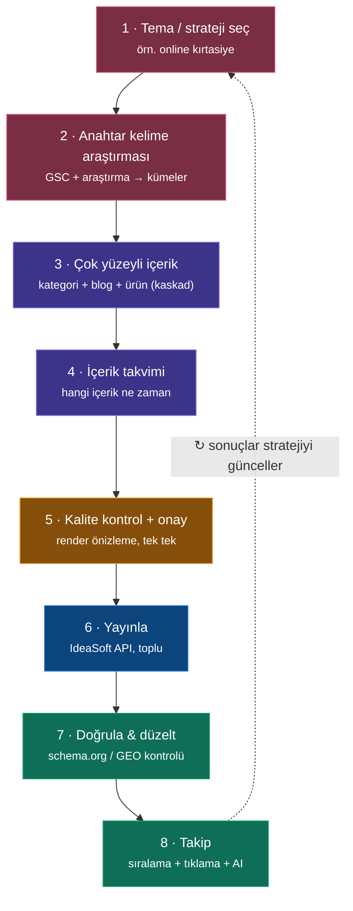
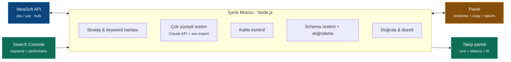

# SEO-Otomasyon

> IdeaSoft tabanlı e-ticaret mağazaları için **konu kümesi (topical authority) odaklı,
> GSEO + GEO uyumlu içerik motoru.** Bir tema seçersin; sistem anahtar kelimeleri çıkarır,
> kategori + blog + ürün içeriğini eşgüdümlü üretir, zamanla planlar, IdeaSoft'a yazar,
> schema/GEO açısından doğrular ve sonucu ölçer.


---

## Bu sadece bir "ürün açıklaması üreticisi" değil

Standart araçlar tek bir ürün için tek paragraf üretir. Bu proje bir **strateji motorudur**:
bir tema (örn. "online kırtasiye ürünleri") etrafında, o temanın anahtar kelimeleriyle
**birbirini güçlendiren çok sayıda içerik yüzeyi** üretir ve hepsini ölçülebilir kılar.

## GSEO + GEO nedir, neden ikisi birden?

- **GSEO (Google SEO)**: klasik arama — sıralama, tıklama, schema, sayfa yapısı.
- **GEO (Generative Engine Optimization)**: ChatGPT, Gemini, Perplexity gibi yapay zeka
  motorlarının cevap üretirken senin içeriğini **kaynak göstermesi**.

Google FAQ *rich result*'ları Mayıs 2026'da kaldırıldı; yapılandırılmış içeriğin değeri
artık görsel SERP kutusunda değil, **AI'ın içeriği ayrıştırıp alıntılamasında.** Bu yüzden
proje GEO-önceliklidir.

## Nasıl çalışır (adımlar)



**Renk anlamları:** 🔴 Strateji · 🟣 Üretim · 🟠 Sen (onay) · 🔵 IdeaSoft · 🟢 Takip

## Neden farklı / neden savunulabilir?

- **Eşgüdüm**: tek tema → kategori + blog + ürün, hepsi aynı kelime mimarisinde.
- **Platforma yazar**: içeriği üretip bırakmaz; IdeaSoft API ile toplu günceller.
- **Doğrula-düzelt döngüsü**: schema okunuyor mu / AI alıntılıyor mu kontrol eder, düzeltir.
- **GEO-öncelikli + niş**: Türk e-ticaret / IdeaSoft ekosistemine özel.
- **Ölçülebilir**: "his" değil — GSC ve AI görünürlüğüyle kanıt.

## Mimari



## Teknoloji yığını

| Katman | Seçim |
|--------|-------|
| Backend | Node.js + TypeScript (strict) |
| AI üretim | Claude API (Messages) + `seo-expert` mantığı |
| Veri tabanı | SQLite → Postgres/Supabase (keyword merkezli) |
| Panel | Next.js + Recharts |
| Veri kaynağı | IdeaSoft API + Google Search Console API |
| Planlama | Basit içerik takvimi (cron seviyesinde; ağır kuyruk yok) |
| Toplu işlem | `p-limit` |

## Yol haritası

- [ ] **Faz 0 — Ölçüm zemini + teşhis**: GSC bağlantısı, treated/control gruplama, baz
      metrikler, schema.org doğrulama (SSS/Product okunuyor mu?).
- [ ] **Faz 1 — Ürün hattı MVP**: çek → üret → kalite kontrol → onay → IdeaSoft'a yaz.
- [ ] **Faz 2 — Strateji + çok yüzeyli içerik**: tema seç → keyword haritası → kategori +
      blog + ürün içeriği (kaskad) → schema enjeksiyonu → içerik takvimi.
- [ ] **Faz 3 — Takip + GEO + doğrula/düzelt**: sıralama/tıklama dashboard, AI'da kaynak
      gösterilme takibi, schema okunmuyorsa otomatik düzeltme döngüsü.

## Kurulum

> Proje erken aşamada. Adımlar geliştirme ilerledikçe güncellenecek.

```bash
git clone https://github.com/yukseelalkis/Seo-Otomasyon.git
cd Seo-Otomasyon
npm install
# .env: IdeaSoft API (client id/secret), Claude API key, GSC kimlik bilgileri
```

## Proje dokümanları

- [`CLAUDE.md`](./CLAUDE.md) — proje anayasası ve kuralları (AI asistanı için)
- [`SKILL.md`](./SKILL.md) — üretim mantığı ve kalite kapısı
- [`ARCHITECTURE.md`](./ARCHITECTURE.md) — mimari, veri modeli, karar kayıtları
- [`ISSUES.md`](./ISSUES.md) — açılacak iş kalemleri (örnek issue'lar)

## Durum

Aktif geliştirme — kişisel yatırım / build-in-public projesi. İlk doğrulama
[mavikalem.tr](https://www.mavikalem.tr) üzerinde yapılıyor.
